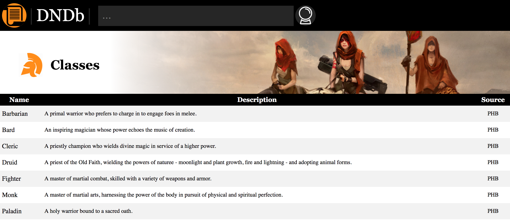
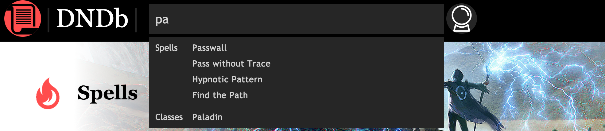
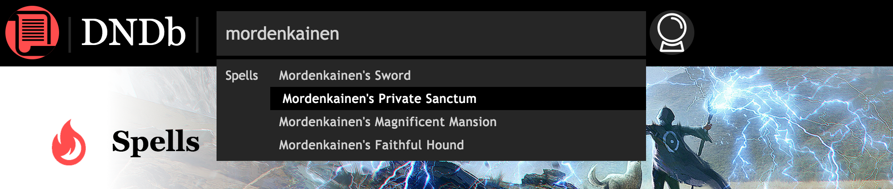
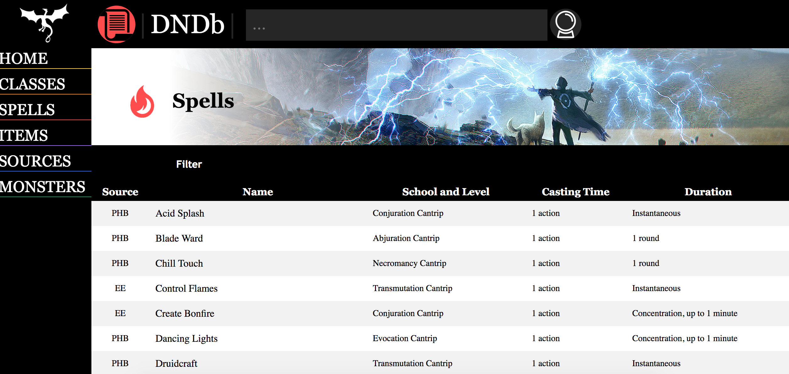

# DnDb (work in progress)

This is a Rails web application to help quickly reference the Dungeons and Dragons 5e ruleset. Seeing as the rules of the game are licensed, no rules are included. Instead, the framework for spells, classes, items, etc. and a web interface to interact with them is included in this repository.

This was also an exercise for me in front-end and user interface design. The goal is to make something as easy to use as possible.

This project currently includes a rich set of filtering options for spells, as well as support for material from all kinds of sources, from core rulesets to homebrew content. The `SpellBuilder` class can parse pdfs using the `pdf-reader` gem, and construct spells to save to the database from there.

Finally, the search bar at the top of the page is a global autocompleting search allowing users to quickly reference any rule or thing in the database, from spells to sources to classes. The autocomplete is made faster by using a [Redis](https://redis.io/) server and [soulmate by SeatGeek](https://github.com/seatgeek/soulmate).

External Dependencies:
 * Global autcomplete is performed with an active Redis server
 * `ImageMagick` is require for Source thumbnail generation from PDFs